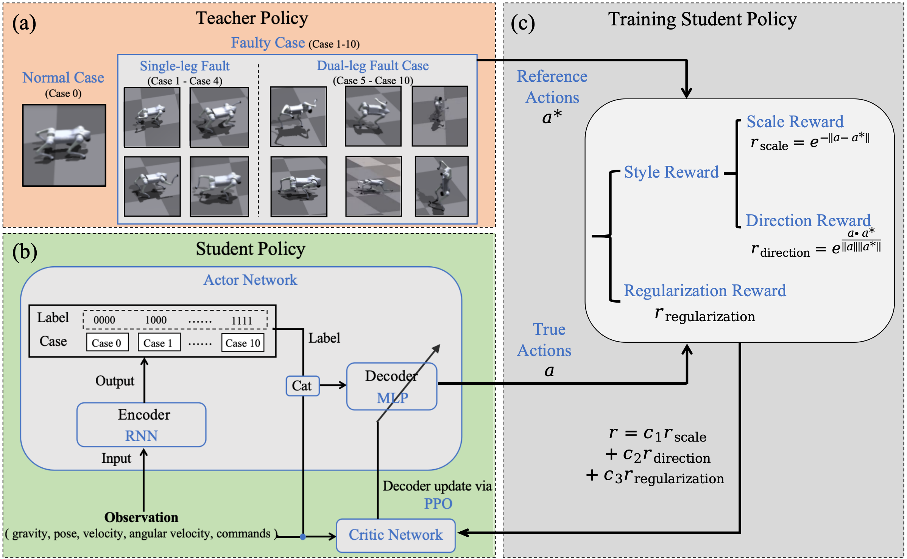

# AcL-ActionLearner

## FRAMEWORK

**Overview.** A teacher-student framework is applied to train a single agent to learn multiple gaits. 
Teacher policies are trained in advance separately to address different fault cases. The policy backbone 
is an encoder-decoder architectural network. The encoder and decoder are both trained online while parameters 
are renewed dividedly. The encoder is trained via a supervised method. The decoder is trained via an RL method. 
The rewards include 2 parts, style rewards based on the similarity between teacher policies and the student policy, 
and the regularization rewards that ensure robust locomotion. The trained agent can adaptively switch from different cases.

## VIDEOS

### Teacher Polices Shown in Gazebo

### Real World Deployment

<table align="center">
    <tr>
        <td align="center" width="33%">
            
            
The quadruped can adaptively switch its gait when faults occur and are resolved without any command given. (Faults on LR)

        </td>
        <td align="center" width="33%">
            
            
The quadruped can adaptively switch its gait when faults occur and are resolved without any command given. (Faults on RR)

        </td>
    </tr>
    <tr>
        <td align="center" width="33%">
            
            
The quadruped can resist kicking when performing both normal gait and fault gaits.

        </td>
        <td align="center" width="33%">
            
            
The quadruped can stably load parcels. (This parcel is 1.1kg and not strictly fixed on the quadruped)

        </td>
        <td align="center" width="33%">
            
            
The quadruped can cross surfaces with different textures in a single locomotion task.

        </td>
    </tr>
</table>

## TODO

**After acceptance we will release all the following code!**

- Training configs for teacher policies
- Training codes for both teacher policies and the student policy based on [legged_gym](https://github.com/leggedrobotics/legged_gym) and [rsl_rl](https://github.com/leggedrobotics/rsl_rl)
- Checkpoints for teacher policies, encoder, and decoder
- Sim2real suitable for loosing-torque faults manipulation based on [rl_sar](https://github.com/fan-ziqi/rl_sar)

## ASKING FOR HELP
We’re afraid of damaging the quadruped, so we haven’t tested the standing and hand-standing gaits in real cases yet. We will sincerely appreciate it if someone can share checkpoints/training configs that are tested to be valid for Go2 standing and hand-standing in real cases for these two gaits!

