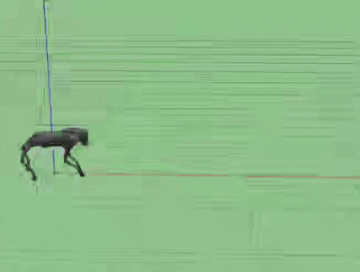
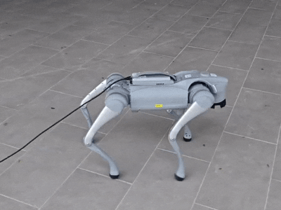

# AcL-ActionLearner

## FRAMEWORK

**Overview.** A teacher-student framework is applied to train a single agent to learn multiple gaits. 
Teacher policies are trained in advance separately to address different fault cases. The policy backbone 
is an encoder-decoder architectural network. The encoder and decoder are both trained online while parameters 
are renewed dividedly. The encoder is trained via a supervised method. The decoder is trained via an RL method. 
The rewards include 2 parts, style rewards based on the similarity between teacher policies and the student policy, 
and the regularization rewards that ensure robust locomotion. The trained agent can adaptively switch from different cases.

## VIDEOS

### Teacher Polices Shown in Gazebo

#### Normal Case
<table width="100%">
    <tr>
        <td align="left" colspan="6">
            
        </td>
    </tr>
</table>

#### Single-leg Fault
<table width="100%">
    <tr>
        <td align="left"></td>
        <td align="left"></td>
        <td align="left"></td>
        <td align="left"></td>
    </tr>
</table>

#### Double-leg Fault
<table width="100%">
    <tr>
        <td align="left"></td>
        <td align="left"></td>
        <td align="left"></td>
        <td align="left"></td>
        <td align="left"></td>
        <td align="left"></td>
    </tr>
</table>

### Real World Deployment

<table align="center">
    <tr>
        <td align="center" width="33%">
            
            
The quadruped can adaptively switch its gait when faults occur and are resolved without any command given. (Faults on LF)

        </td>
        <td align="center" width="33%">
            
            
The quadruped can adaptively switch its gait when faults occur and are resolved without any command given. (Faults on RF)

        </td>
        <td align="center" width="33%">
            
            
The quadruped can adaptively switch its gait when faults occur and are resolved without any command given. (Faults on LR)

        </td>
    </tr>
    <tr>
        <td align="center" width="33%">
            
            
The quadruped can adaptively switch its gait when faults occur and are resolved without any command given. (Faults on RR)

        </td>
        <td align="center" width="33%">
            
            
The quadruped can adaptively switch among limping gaits. (normal2LF2RF2normal)

        </td>
        <td align="center" width="33%">
            
            
The quadruped can adaptively switch among limping gaits. (normal2RR2LR2normal)

        </td>
    </tr>
    <tr>
        <td align="center" width="33%">
            
            
The quadruped can cross slippery surfaces with water.

        </td>
        <td align="center" width="33%">
            
            
The quadruped can resist kicking when performing both normal gait and fault gaits.

        </td>
        <td align="center" width="33%">
            
            
The quadruped can stably load parcels. (This parcel is 1.1kg and not attached to the quadruped)

        </td>
    </tr>

</table>

## TODO

**After acceptance we will release all the following code!**

- Training configs for teacher policies
- Pre-training codes for student policy encoder & decoder
- Training codes for both teacher policies and the student policy based on [legged_gym](https://github.com/leggedrobotics/legged_gym) and [rsl_rl](https://github.com/leggedrobotics/rsl_rl)
- Checkpoints for teacher policies, encoder, and decoder
- Sim2real suitable for loosing-torque faults manipulation based on [rl_sar](https://github.com/fan-ziqi/rl_sar)

## PRECAUTIONS & ASKING FOR HELP

On surfaces with slight slopes, relatively slip textures (such as tiled or wet floors), or minimal disturbances (for example, mosaic tiles, roads with larger gaps between bricks, highways, or lawns with short grass), this policy has been tested and proven valid and stable. However, if you plan to test this policy on extremely slippery surfaces (such as ice or snow), please **be careful**, as we have not yet evaluated its performance under those conditions.

We’re afraid of damaging the quadruped, so we haven’t tested the standing and hand-standing gaits in real cases yet. **We only ensure that policies for these gaits exhibit normal performance in simulation, but we cannot guarantee their performance in real cases so be careful if you need to test them in real cases!**  We will sincerely appreciate it if someone can share checkpoints/training configs that are tested to be valid for Go2 standing and hand-standing in real cases for these gaits!

